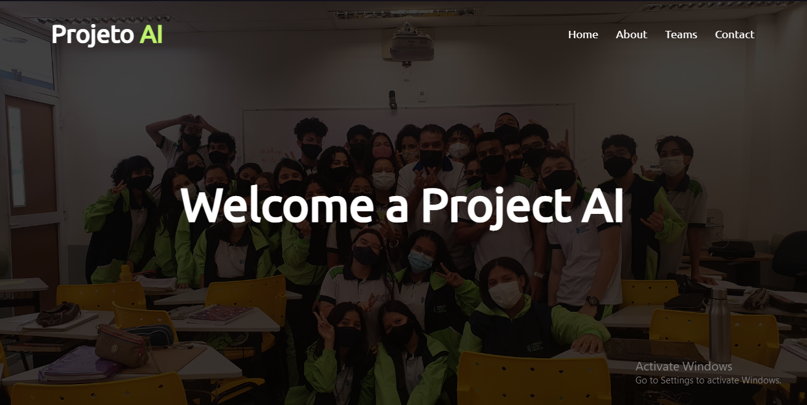

# Project-AI



## 📄 Goal:

creation of a class website, so you can remember a few moments through it

## ☕ Using Project_AI

to use Project_AI, follow these steps:

1. open the git bash terminal
2. enter the following code:
```
git clone https://github.com/MokdcyVictor/Project_AI.git
```

## 🔧 Function
- [X] to be a website
- [X] remember every moments 
## 🙋‍♂️ Authors:
<table>
  <tr>
    <td align="center">
      <a href="#">
        <br>
        <sub>
          <b>João Mokdcy</b>
        </sub>
      </a>
    </td>
